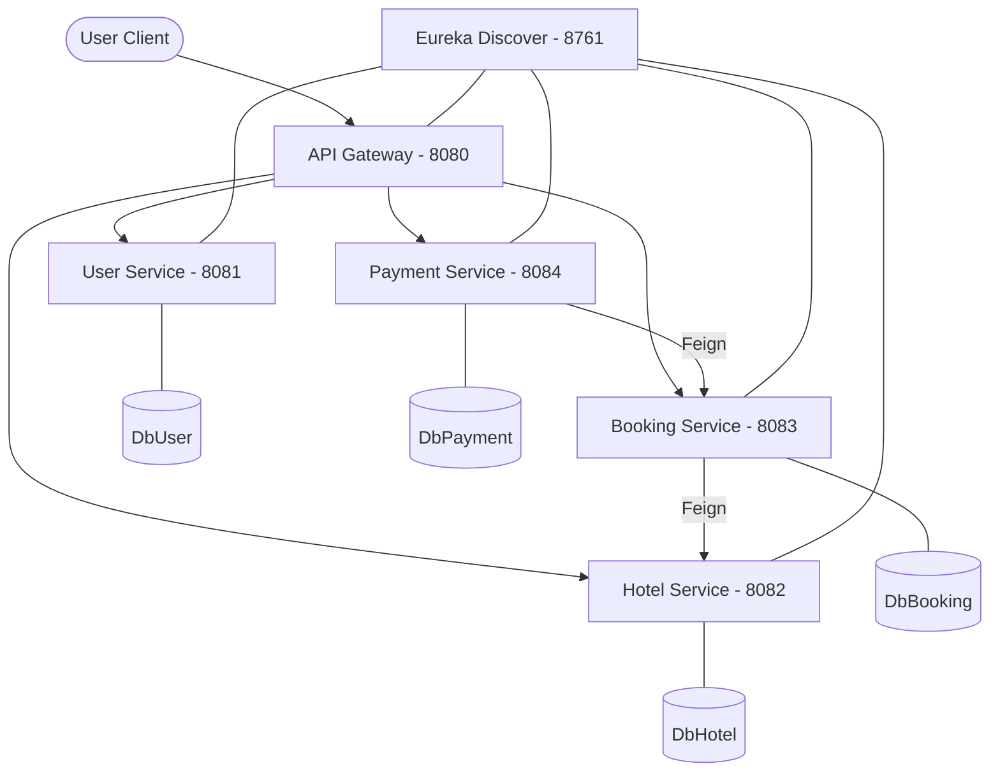

# 🏗️ BookInn Backend Documentation

## 🌟 Overview
BookInn is a microservices-based hotel reservation system designed for scalability and reliability. It manages user authentication, hotel listings, real-time inventory-aware bookings, and Razorpay-integrated payments.

---

## 📂 System Architecture

---

## 🛡️ Security Model (JWT)
The system uses stateless JWT authentication.
1. **Generation**: `user-service` generates tokens containing `username`, `userId`, and `role`.
2. **Propagation**: The `API Gateway` forwards the `Authorization: Bearer <token>` header to downstream services.
3. **Validation**: Each service contains a `JwtFilter` that decrypts the token locally (shared secret-key) and populates the `SecurityContext`.
4. **Roles**: `CUSTOMER`, `MANAGER`, `ADMIN`.

---

## 📅 Core Logic: Inventory Management
In `booking-service`, availability is calculated on-the-fly to prevent overbooking:
- **Formula**: `Available = Total_Rooms (from Hotel-Service) - Booked_Rooms (Confirmed/Pending overlap in dates)`.
- **Conflict Query**: Counts rooms where `(checkIn < :newOut AND checkOut > :newIn)`.

---

## 💳 Core Logic: Payment Flow
1. **Initiation**: `payment-service` calls `booking-service` to verify price and ownership, then creates a **Razorpay Order**.
2. **Verification**: After UI payment, the service checks the `HMAC-SHA256` signature using the Razorpay Secret.
3. **Confirmation**: Once verified, it calls `PUT /bookings/{id}/payment-success` to finalize the status.
4. **Webhook**: Provides a fallback for cases where the user closes the browser before verification completes.

---

## 🧪 Technical Stack
- **Framework**: Spring Boot 3+ / Java 17
- **Discovery**: Netflix Eureka
- **Routing**: Spring Cloud Gateway
- **Communication**: OpenFeign (Synchronous REST)
- **Database**: MySQL 8.0
- **Build Tool**: Maven
- **Payments**: Razorpay SDK

---

## 🚀 Running Locally
1. Start `eureka-server`.
2. Start all 4 microservices.
3. Start `api-gateway`.
4. Access everything via `http://localhost:8080/api/...`.
